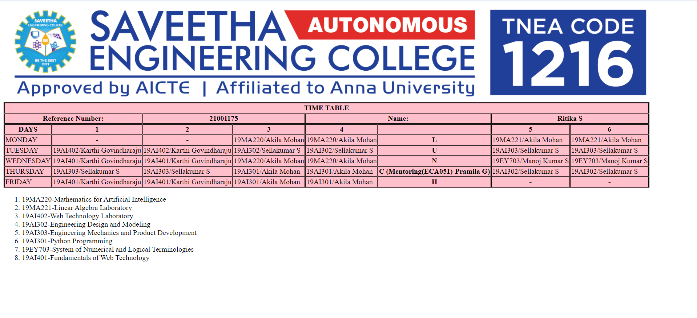

# Experiment_Time_Table

## AIM
To Write a html webpage page to display your timetable.

# ALGORITHM
### STEP 1
create a simple table using table tag
### STEP 2
Add header row using th tag
### STEP 3
Add your timetable
### STEP 4
Execute the program

# CODE
~~~<!DOCTYPE html>
<html>
<head>
<title>TIME TABLE</title>
</head>
<body>

<table border = "1" cellspacing="1" bordercolor="black"
bgcolor="pink">
<tr>
<th colspan="8">TIME TABLE</th>
</tr>
<tr>
<th colspan="2">Reference Number:</th>
<th colspan="2">21001175</th>
<th colspan="2">Name:</th>
<th colspan="2">Ritika S</th>
</tr>
<tr>
<tr>
<th>DAYS</th>
<th>1</th>
<th>2</th>
<th>3</th>
<th>4</th>
<th></th>
<th>5</th>
<th>6</th>
</tr>

<td>MONDAY</td>
<td align="center"><b>-</b></td>
<td align="center"><b>-</b></td>
<td>19MA220/Akila Mohan</td>
<td>19MA220/Akila Mohan</td>
<td align="center"><b>L</b></td>
<td>19MA221/Akila Mohan</td>
<td>19MA221/Akila Mohan</td>
</tr>
<tr>
<td>TUESDAY</td>
<td>19AI402/Karthi Govindharaju</td>
<td>19AI402/Karthi Govindharaju</td>
<td>19AI302/Sellakumar S</td>
<td>19AI302/Sellakumar S</td>
<td align="center"><b>U</b></td>
<td>19AI303/Sellakumar S</td>
<td>19AI303/Sellakumar S</td>
</tr>
<tr>
<td>WEDNESDAY</td>
<td>19AI401/Karthi Govindharaju</td>
<td>19AI401/Karthi Govindharaju</td>
<td>19MA220/Akila Mohan</td>
<td>19MA220/Akila Mohan</td>
<td align="center"><b>N</b></td>
<td>19EY703/Manoj Kumar S</td>
<td>19EY703/Manoj Kumar S</td>
</tr>
<tr>
<td>THURSDAY</td>
<td>19AI303/Sellakumar S</td>
<td>19AI303/Sellakumar S</td>
<td>19AI301/Akila Mohan</td>
<td>19AI301/Akila Mohan</td>
<td align="center"><b>C (Mentoring(ECA051)-Pramila G)</b></td>
<td>19AI302/Sellakumar S</td>
<td>19AI302/Sellakumar S</td>
</tr>
<tr>
<td>FRIDAY</td>
<td>19AI401/Karthi Govindharaju</td>
<td>19AI401/Karthi Govindharaju</td>
<td>19AI301/Akila Mohan</td>
<td>19AI301/Akila Mohan</td>
<td align="center"><b>H</b></td>
<td align="center"><b>-</b></td>
<td align="center"><b>-</b></td>
</tr>
</table>
<ol type="1">
<li>19MC802-Environmental Science</li>
<li>19MA220-Mathematics for Artificial Intelligence</li>
<li>19MA221-Linear Algebra Laboratory</li>
<li>19AI402-Web Technology Laboratory</li>
<li>19AI302-Engineering Design and Modeling</li>
<li>19AI303-Engineering Mechanics and Product Development</li>
<li>19AI301-Python Programming</li>
<li>19EY703-System of Numerical and Logical Terminologies</li>
<li>19AI401-Fundamentals of Web Technology</li>
</body>
</html>
~~~
# OUPUT

# RESULT
The timetable is created successfully.